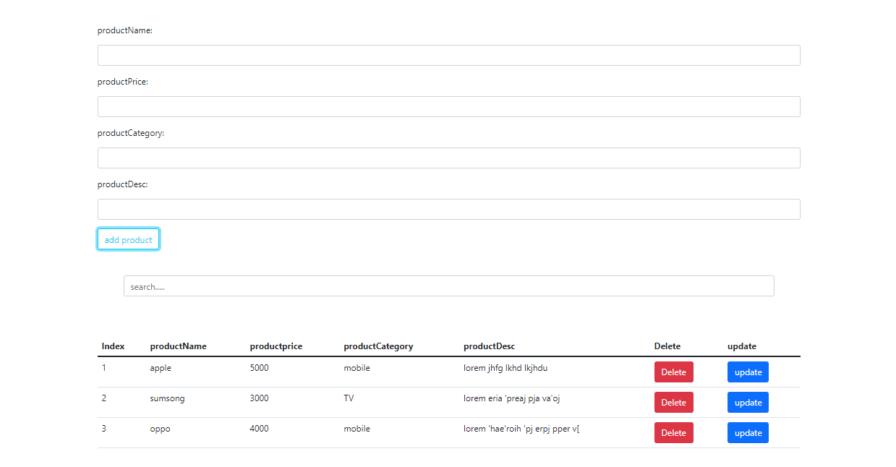

CRUD - project

Frist test in my career to learn Full-Stack

* Done by HTML & CSS & bootstarp 5 & JavaScript & Local Storage 
* The is frist project by js 
* I used local storage to stor the data of users

The picture shows the page

